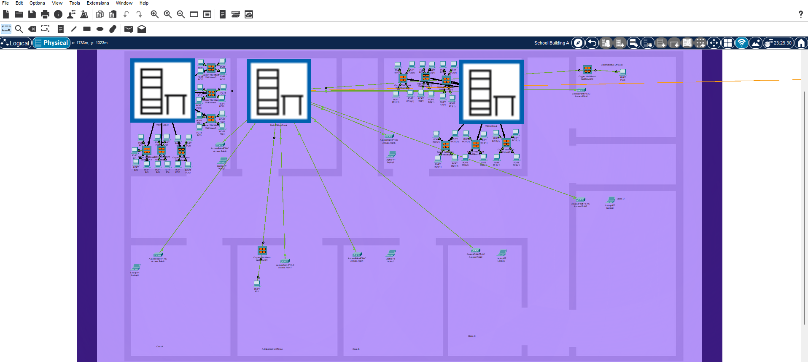
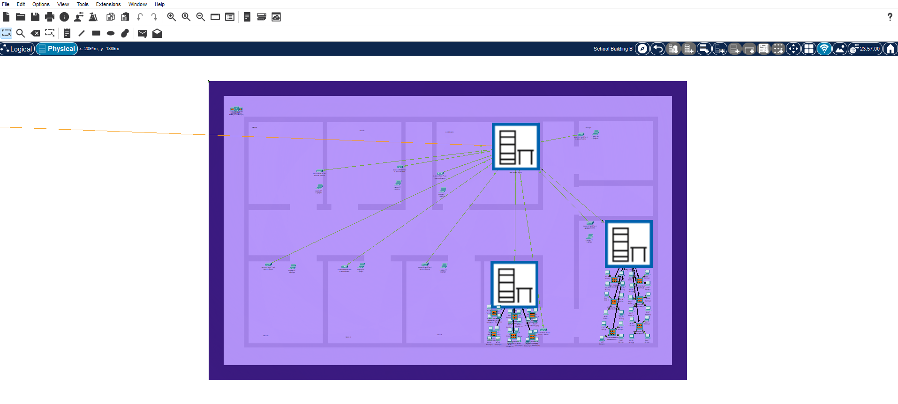
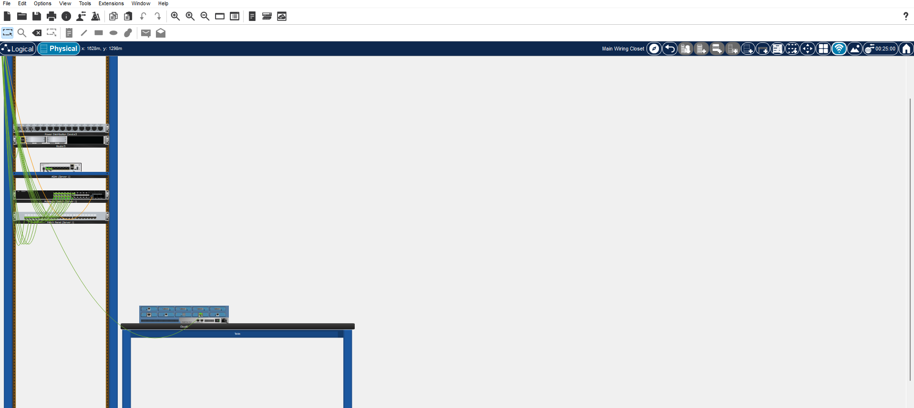

# Multi-School Campus Network Design

**Cisco Packet Tracer Project**  
**WE School El-Minya – Cybersecurity Department**  
**April 2025** | [Network_Configuration_Report (Docx)](Network_Configuration_Report.Dock) | [Download .pkt File](School_Network.pkt)

## Project Overview
Designed and implemented a complete **hierarchical enterprise network** connecting **two separate schools** (School A & School B) via fiber optic uplinks.  
The network serves **98 devices** across both schools in a realistic educational environment.

## Key Features
- Hierarchical design (Core + Access Layer)
- 4 VLANs: Lab_A, Lab_B, Managers, WiFi
- Centralized DHCP Server on Core Switch 1 (School A)
- Inter-VLAN routing + Trunk links between the two schools
- 16 Wireless Access Points (SSID: We)
- NAT + Static Routing for Internet access (Cloud-PT)
- Cisco ASA 5506 Firewall for traffic filtering and security
- Full password security with encryption on all devices

## Technologies & Devices Used
- **Core Switches**: Cisco Catalyst 3650 (Layer 3)
- **Access Switches**: Cisco Catalyst 2960
- **Router**: Cisco ISR 4331
- **Firewall**: Cisco ASA 5506
- **Access Points**: AP-PT-AC (16 APs)
- **Simulation Tool**: Cisco Packet Tracer

## Screenshots

## Full Documentation
- Complete Cisco IOS configurations for all devices
- IP addressing scheme and VLAN segmentation
- Device selection rationale and speed specifications
- Security features and network advantages

**Full technical report, configurations, and .pkt file are available in the repository.**

---

**Made with ❤️**
